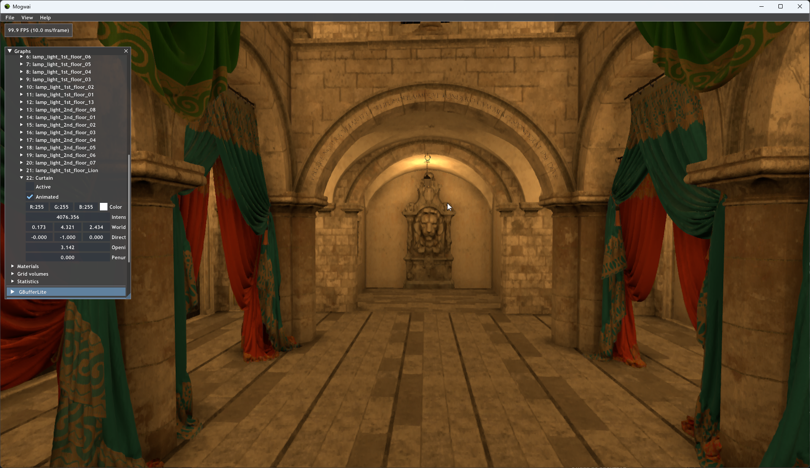
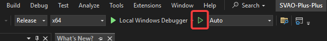
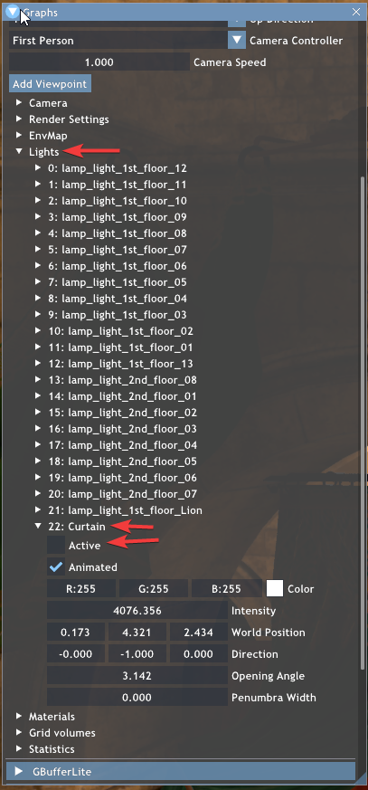
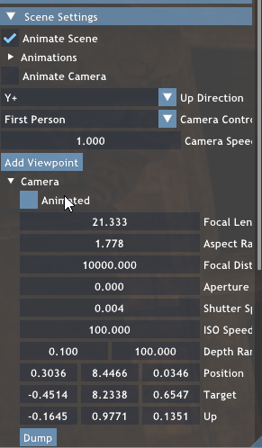
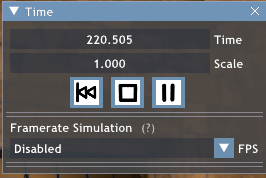
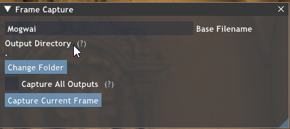
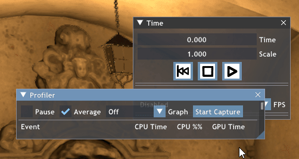
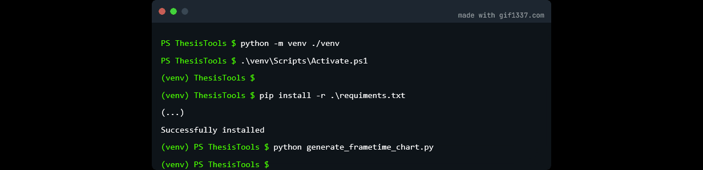

# SVAO Plus Plus
SVAO Plus Plus to algoryrytm ambient occlusion użyty w pracy ,,Algorytm wolumetrycznej okluzji otoczenia korzystający ze stochastycznego bufora głębi''.



**Uwaga wszystkie ścieżki zostały podane względem katalogu root repozytorium**

## Wymagania
Do skompilowania projektu będą potrzebne:
* Windows 10 version 20H2 lub nowszy
* zestaw narzędzi kompilacyjnych `Visual Studio 2022`
* [Windows 10 SDK (10.0.19041.0) for Windows 10, version 2004](https://developer.microsoft.com/en-us/windows/downloads/windows-10-sdk/)
* cmake
* git
* karta graficzna 
    * wspierająca DirectX Raytracing (Co najmniej Shader model 6.8).
    (Prawdopodobnie należy posiadać kartę z serii RTX30XX (Ampere) lub nowszą).
    * co najmniej 4GB VRam dla sceny `SunTemple` lub co najmniej 8GB VRam dla scen opartych o `Sponza`.
    * Potwierdzone działanie na RTX 3060Ti (8GB), RTX 3050 (4GB), AMD Radeon 9070XT (16GB).
* interperter python (warto dodać go do `PATH` podczas instalacji.)
 

## Kompilacja projektu
Aby pobrac repozytorium z projektem należy wykonać polecenie (będąc w katalogu docelowym)

```sh
git clone https://github.com/Erulathra/SVAO-Plus-Plus.git
```

Po pobraniu repozytorium należy zsynchronizować wszystkie zależności za pomocą jednego ze skrtyptów:
* `setup.bat` -- tylko pobiera pod repozytoria (zależności)
* `setup_vs2022.bat` -- pobiera zależności oraz generuje projekt Visual Studio 2022 **(zalecane)**
* `setup.sh` -- wersja skrytpu przeznaczona na systemy GNU+Linux.

Po zakończeniu wykonywania skryptu `setup_vs2022.bat` w katalogu `build\windows-vs2022`
powinien się znaleść plik solucji `SVAO-Plus-Plus.sln`, który należy uruchomić w Visual Studio,
lub innym ulubionym IDE.

**Po wczytaniu solucji należy upewnić się że startowym projektem jest projekt `Mogwai`.**

Następnie wystarczy skompilwoać projekt (najlepiej w wersji `Release`) za pomocą opcji
`Start without debugging` (zielony trójkąt).



## Obsluga Mogwai

### Wczytywanie render graph
Wszystkie grafy (skrypty render graph) znajdują się w katalogu `scripts`. Aby je
wczytać należy przeciągnąć jeden z nich na ekran programu. Poniżej znajdują się krótkie opisy render 
graphów użytych w pracy:
* `HBAO.py` -- Prosta implementacja HBAO
* `VAO.py` -- Prosta implementacja VAO
* `RTAO,py` -- Implementacja AO metodą raytracingu
* `SVAO_baseline.py` -- Algorytm bazowy SVAO
* `SVAO_PP_Prepas.py` -- Algorytm SVAO++ ze wszytkimi usprawnieniami
* `SVAO++.py` -- **Nie używać, stary skrypt**

Ostatnie skrypty można również wczytać za pomocą paska narzędzi (lewy górny róg).
(`File >> Recent Scripts`) 

### Wczytywanie sceny
Aby wczytać scenę wystarczy przeciągnąć plik `.pyscene` na okno programu. W oknie 
konsoli powinny pojawić się logi związane z kompilacją shaderów i wczytywaniem sceny.
Jeżeli załadowany jest już jakikolwiek render graph na ekranie pojawi się scena.

Ostatnie sceny można również wczytać za pomocą paska narzędzi (lewy górny róg).
(`File >> Recent Scenes`) 

#### Uwaga do SponzaV2
W ramach testu nakładania (rozdział 4.1, rysunki 4.1 i 4.2) do sceny dodałem bardzo
intensywne światło punktowe. W ramach innych testów należy je wyłączyć za pomocą:

```cpp
Scene Settings >> Lights >> Curtain >> Active
```



### Obsłga kamery
Kamerą można sterować w trybie `free camera` (lewy przycisk myszy). Kamera zachowuje
się dokładnie tak samo jak w Unreal Engine, czyli `WASD` sterujemy pozycją kamery,
a za pomocą myszy możemy sterować obrotem (tak jak w grach FPS).

Kliknięcie ekranu wyłącza animacje kamery i przełącza ją w tryb `free camera`, aby 
ją przywrócić, należy zaznaczyć opcje:

```
Scene Settings >> Animate Camera
```



### Obsługa kontrola czasu i animacji
Aby wywołać panel kontroli czasu i animacji należy nacisnąć przycisk `F9` lub 
wybrać opcje `Time` z menu `View` który znajduję się na pasku narzędzi.



### Zapis buforów ekranu do pliku
Za pomocą narzędzia `View >> Frame Capture` można zapisać bufory ekranu do pliku `png`
wszystkich przejść, które są oznaczone jako output. W praktyce bufor ramki i bufor AO.



### Testowanie wydajności
Za pomocą przycisku `P` na klawiaturze można wywołać narzędzie `Profiler`. Domyślnie
mierzy średni czas przetwarzania wszystkich przejść zawartych w render graphie. 
Aby przeprowadzić test wydajności należy kolejno:
* Kliknąć `Start Capture`
* [Uruchomić animacje](###zapis-buforów-ekranu-do-pliku)
* Po wykonaniu animacji należy nacisnąć `End Capture` i wybrać docelową ścieżkę
  pliku z wynikami.



Aby zsynchronizować animacje w kilku testach można albo zedytować wynikowy plik
`json` lub odpowiednio szybko kliknąć oba przyciski. W praktyce na wykresach 
nie będzie widać kilku klatek różnicy, a interesuje nas głównie względna różnica
renderowania klatki.

## Przygotowanie środowiska python
Aby wygenerować nowe środowisko virtualne należy skorzystać z polecenia:
```sh
python -m venv ./venv
```
następnie należy wczytać to środowisko. W zależności od platformy należy uruchomić
```sh
# bash (Linux)
source venv/bin/activate

# power shell (Windows)
./venv/bin/activate.ps1

# cmd
./venv/bin/activate.bat
```

Aktywowanie środowiska powinno zmienić znak zachęty.

Następnie należy zainstalować zależności.
```
pip install -r ./requiments.txt
```




## Generowanie wyników
Wszystkie wykresy i wyniki użyte w pracy można wygenerować za pomocą dwóch skrytptów:
* `ThesisTools/generate_frametime_chart.py`
* `ThesisTools/frame_analisis.py`

W katalogu `ThesisTools/Data` zamieściłem wszystkie wyniki testów oraz wygenerowane
obrazki. Uruchomienie pierwszego ze skrtyptów wygeneruje wykresy w katalogu 
`ThesisTools/Output`, a uruchomienie drugiego wypisze wyniki na ekranie.

### Wykresy wydajności
Aby wygenerować wykres dłuogości przetwarzania należy wywołać funkcje `draw_compare_chart`.
Pozwala ona porównać do 3 różnych wykresów z dowolną ilością kanałów.

```python
channels = [VAO_GPU_NAME, RT_STOCHASTIC_DEPTH_GPU_NAME, SVAO_GPU_NAME]
base_path = "Output/results/blending"

os.makedirs(base_path, exist_ok=True)

# Przykład dla 1 trace
draw_compare_chart(
        load_trace("Data/AOBlending/blending_naive.json"), channels,
        save_path = os.path.join(base_path, "blending_0.png")
    )

# Przykład dla 2 traceów
draw_compare_chart(
        load_trace("Data/AOBlending/blending_naive.json"), channels,
        load_trace("Data/AOBlending/blending_ambient.json"), channels,
        save_path = os.path.join(base_path, "blending_1.png")
    )

# Przykład dla 3 traceów
draw_compare_chart(
        load_trace("Data/AOBlending/blending_naive.json"), channels,
        load_trace("Data/AOBlending/blending_ambient.json"), channels,
        load_trace("Data/AOBlending/blending_luminance.json"), channels,
        save_path = os.path.join(base_path, "blending_2.png")
    )
```

Kanały użyte w pracy zostały zdefiniowane na początku skryptu w postaci zmiennych
globalnych. Aby dodać inny kanał należy podać jego ścieżkę w JSONie. Dla każdego
pliku json można skonfigurować osobne kanały.

Aby zmienić opisy osi należy zmodyfikować paramwtry wywołania metod `plt.ylabel`
i `plt.xlabel`.

Wielkość fonta można zmienić edytując zmienna `FONT` na początku skrtyptu.

### Analiza klatki

Aby wykonać analize podobieństwa i szumu klatek należy uruchomic skrypt `frame_analisis.py`.
Wykona on analize porównawczą klatek a następnie wypisze wartości któe zostały zamieszczone
w tabelach.

Aby dodać dodaktową analize dwóch klatek. należy dodać do funkcji main wywołanie
funkcji `analyze_frame` z dwoma parametrami będącymi ścieżkami do plików.

# Krótki opis jak wygenerować wyniki
* Rys. 4.1 - 4.4 Blending Mode
  * Scena: `SponzaV2.pyscene`
  * Skrypt: `SVAO_PP_Prepass.py`
  * Tryb nakładania zmienia się za pomocą `DefferedLightnig >> AO Blend mode`
  * Wartość ambient light: `DefferedLightnig >> Ambient Light`
  * kanały: `DEFERRED_LIGHTING_NAME`

* Rys. 4.5 - 4.6
  * Sceny: `SponzaV2.pyscene`, `SponzaV2_NoCurtains.pyscene`
  * Skrypt: `SVAO_PP_Prepass.py`
  * Adaptacyjne próbkowanie można wyłączyć za pomocą `VAO/SVAO >> Enable Adaptive sampling`
  * kanały: `VAO_GPU, RT_STOCHASTIC_DEPTH_GPU, SVAO_GPU`

* Rys  4.7 - 4.8
  * Sceny: `SponzaV2.pyscene`, `SponzaV2_NoCurtains.pyscene`
  * Skrypt: `SVAO_PP_Prepass.py`
  * Przejście odrzucające można przełączać za pomocą: `VAO/SVAO >> Use prepass`
  * Zmiana heurystyki: `VAO/SVAO >> Prepass sampling mode`
  * kanały: 
    * bez odrzucania `VAO_GPU, RT_STOCHASTIC_DEPTH_GPU, SVAO_GPU`
    * z odrzucaniem `VAO_GPU, RT_STOCHASTIC_DEPTH_GPU, SVAO_GPU, VAO_PREPASS_GPU`

* Rys. 4.9
  * Sceny: `SponzaV2.pyscene`
  * Skrypt: `SVAO_PP_Prepass.py`
  * Zmiana eksponentu `VAO/SVAO >> exponent`

* Rys. 4.10
  * Sceny: `SponzaV2.pyscene`
  * Skrypt:
    * Bufor nieliniowy: `SVAO_Baseline.py`
    * Bufor liniowy: `SVAO_PP_Prepass.py`

* Rys. 4.11
  * Sceny: `SponzaV2.pyscene`, `SponzaV2_NoCurtains.pyscene`
  * Skrypt:
    * SVAO: `SVAO_Baseline.py`
    * SVAO++: `SVAO_PP_Prepass.py`
  * kanały: 
    * SVAO: `DEFERRED_LIGHTING, VAO_GPU, SVAO_GPU, RT_STOCHASTIC_DEPTH_GPU`
    * SVAO++: `DEFERRED_LIGHTING, VAO_GPU, SVAO_GPU, RT_STOCHASTIC_DEPTH_GPU, VAO_PREPASS_GPU`

* Rys. 4.12, 4.13
  * Sceny: `SponzaV2.pyscene`
  * Skrypt:
    * RTAO: `RTAO.py`
    * HBAO: `HBAO.py`
    * SVAO: `SVAO_Baseline.py`
    * SVAO++: `SVAO_PP_Prepass.py`